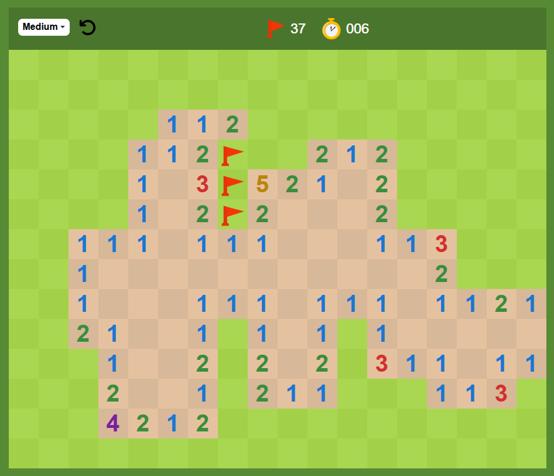

# 💣 Buscaminas

[](https://developer.mozilla.org/en-US/docs/Web/JavaScript)
[](https://developer.mozilla.org/en-US/docs/Web/HTML)
[](https://developer.mozilla.org/en-US/docs/Web/CSS)

[English](./README.md)

Este el clásico juego del Buscaminas, diseñado como el de Google. Este está construido usando **JavaScript**, **HTML5** y **CSS3** puros, sin el uso de bibliotecas o frameworks externos.

Practiqué programación con conceptos como **POO (Programación Orientada a Objetos)**, **programación dinámica**, **matrices**, **colas**, **eventos**, **localStorage**, CSS avanzado como **flex**, **grid**, **variables** y **animaciones**, **módulos** ES6, **patrones de diseño**, diseño **responsive**, **flood fill** (relleno por difusión) y más.



## 📚 Características

- **Juego:** El jugador tiene que descubrir todas las celdas sin chocar con una mina.
- **Temporizador:** El juego tiene un temporizador incorporado para controlar la rapidez con la que se completa el juego.
- **Contador de minas:** Muestra cuántas minas quedan en la cuadrícula.
- Diseño responsivo:** El juego está diseñado para ser jugable en varios tamaños de pantalla.
- **Click-to-Reveal:** Al hacer clic en una celda aparecerá un número (que indica el número de minas circundantes) o una mina (fin del juego).
- Haga clic con el botón derecho para marcar: Haga clic con el botón derecho para marcar minas potenciales.

## 🎮 Instalación

1. Clona este repositorio en tu máquina local:

   ```bash
   git clone https://github.com/tuusuario/buscaminas-clone.git

Y dale a go live
