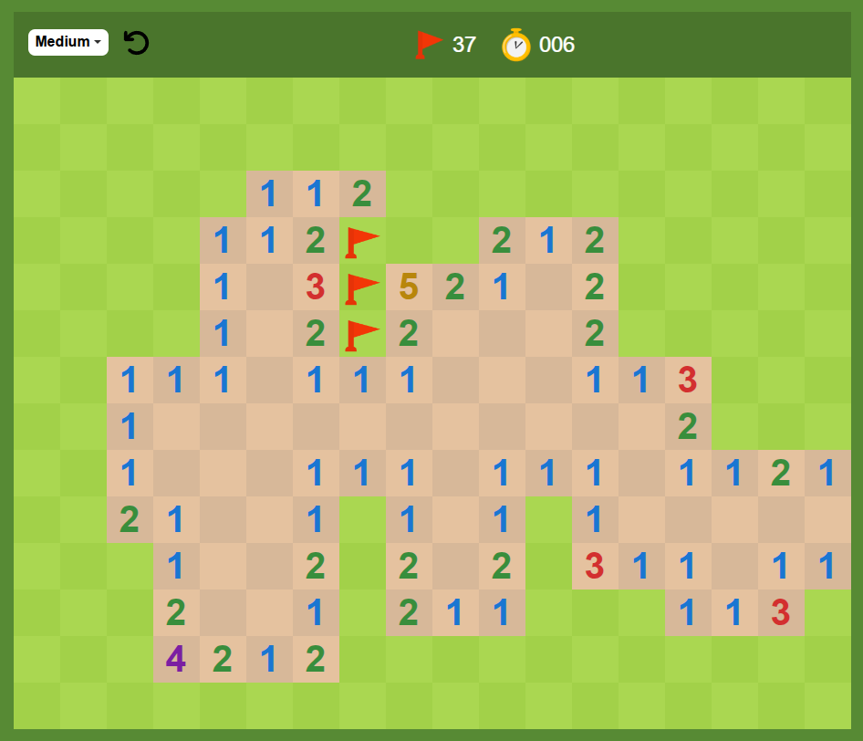

# 💣 Minesweeper

[](https://developer.mozilla.org/en-US/docs/Web/JavaScript)
[](https://developer.mozilla.org/en-US/docs/Web/HTML)
[](https://developer.mozilla.org/en-US/docs/Web/CSS)

[Español](./README-es.md)

This is the classic Minesweeper game, designed to resemble the Google version. The game is built using vanilla **JavaScript**, **HTML5**, and **CSS3** without the use of external libraries or frameworks.

I practiced programming with stuff like **OOP**, **dynamic programming**, **matrix**, **queue**, **events**, **localStorage**, advance CSS like **flex**, **grid**, **variables** and **animations**, **modules** ES6, **design patterns**, **responsive** design, **flood fill** and so on.



## 📚 Features

- **Gameplay:** The player needs to uncover all the cells without hitting a mine.
- **Timer:** The game has a built-in timer to track how fast you complete the game.
- **Mine Counter:** Displays how many mines are left on the grid.
- **Responsive Design:** The game is designed to be playable on various screen sizes.
- **Click-to-Reveal:** Clicking on a cell will either reveal a number (indicating the number of surrounding mines) or a mine (game over).
- **Right-click to Flag:** Right-click to flag potential mines.

## 🎮 Installation

1. Clone this repository to your local machine:

   ```bash
   git clone https://github.com/yourusername/minesweeper-clone.git

And just go live
